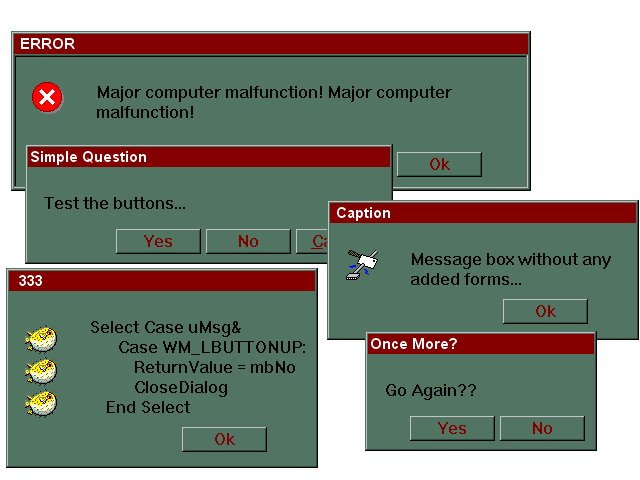



## Message B0x Thru C0de

### Description

<PRE>

This Message box is missing something all the others

have... the form! All you need is the module. The

Message boxes are created when needed at run-time.

It's really simple to use:

<sytax> MBox(sMsg, _

sCaption, _

Optional MsgBoxType, _

Optional lType As Long, _

Optional lIcon As Long, _

Optional oPath As String, _

Optional nX As Long, _

Optional nY As Long, _

Optional Edge As Boolean

) As Integer

You can use one or all of the parameters so many

different types of message boxes can be generated.

Features Include:

----

1.) Will handle nearly any message no matter the size.

2.) YOu do not have to alter or customize the code.

3.) Allows you to set X,Y position.

4.) Enable user to copy the Message or parts of it.

5.) Display 3D Window or sunken Client Edge.

6.) Allows you to use custom Icons.

</PRE>
 
### More Info
 

             |
---                |---
**Submitted On**   |2000-06-09 00:38:56
**By**             |[dcroft  \<aka gh0ul\>](https://github.com/Planet-Source-Code/PSCIndex/blob/master/ByAuthor/dcroft-aka-gh0ul.md)
**Level**          |Intermediate
**User Rating**    |4.2 (21 globes from 5 users)
**Compatibility**  |VB 5\.0, VB 6\.0
**Category**       |[Windows API Call/ Explanation](https://github.com/Planet-Source-Code/PSCIndex/blob/master/ByCategory/windows-api-call-explanation__1-39.md)
**World**          |[Visual Basic](https://github.com/Planet-Source-Code/PSCIndex/blob/master/ByWorld/visual-basic.md)
**Archive File**   |[CODE\_UPLOAD6574692000\.zip](https://github.com/Planet-Source-Code/dcroft-aka-gh0ul-message-b0x-thru-c0de__1-8755/archive/master.zip)

